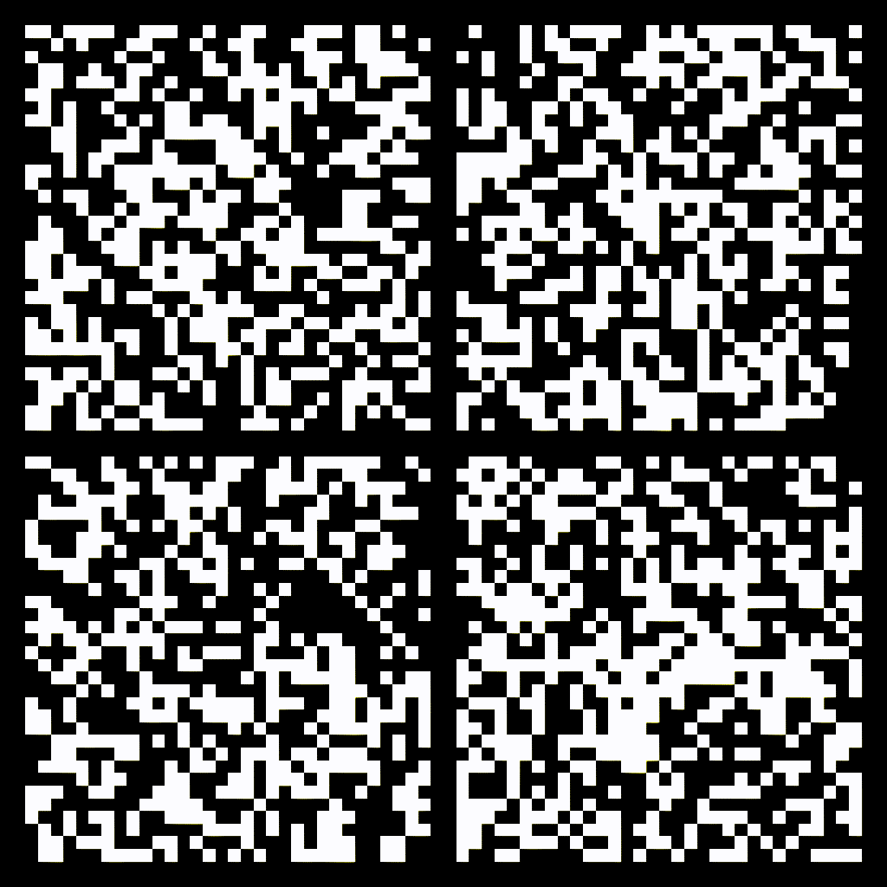
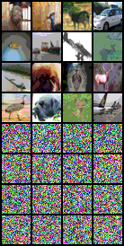
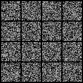
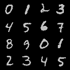

<p align="center">
  
  
</p>


# Minimal Implementation of a D3PM (Structured Denoising Diffusion Models in Discrete State-Spaces), in pytorch


<p align="center">
  
  
</p>


**Special thanks to [fal.ai](https://fal.ai/) for the compute resources for this project.**


This is minimal (400 LOC), but fully faithful implementation of a D3PM [Structured Denoising Diffusion Models in Discrete State-Spaces](https://arxiv.org/abs/2107.03006). in pytorch.

I have tried to keep the code as simple as possible with much comments and explanation that is somewhat lacking on the original jax implementation, so that it is easy to understand. As far as I know, this is the first, faithful reimplementation of D3PM in pytorch. (Please correct me if I am wrong). Of course, this implementation was heavily based on the [official implementation](https://github.com/google-research/google-research/tree/master/d3pm/images).

Difference between this implementation and the official implementation:

* This one has conditional sampling, so as you can see, generations are class-conditioned.
* This one uses rather different/simple model architecture.
* This one simplfies the official implementation very very much, so it is 400 LOC.
* This one does not use truncated logistic reparameterization, but you can use that if you wish.
* Only has uniform sample with inverse-linear beta scheudule, but you can change that with couple loc as well.

## Usage


Following is completely self-contained example.

```bash
python d3pm_runner.py
```

Following uses dit.py, for CIFAR-10 dataset.
  
```bash
python d3pm_runner_cifar.py
```

## Requirements

Install torch, torchvision, pillow, tqdm

```bash
pip install torch torchvision pillow tqdm
```

## Citation

This implementation:

```bibtex
@misc{d3pm_pytorch,
  author={Simo Ryu},
  title={Minimal Implementation of a D3PM (Structured Denoising Diffusion Models in Discrete State-Spaces), in pytorch},
  year={2024},
  howpublished={\url{https://github.com/cloneofsimo/d3pm}}
}
```

Original Paper:

```bibtex
@article{austin2021structured,
  title={Structured denoising diffusion models in discrete state-spaces},
  author={Austin, Jacob and Johnson, Daniel D and Ho, Jonathan and Tarlow, Daniel and Van Den Berg, Rianne},
  journal={Advances in Neural Information Processing Systems},
  volume={34},
  pages={17981--17993},
  year={2021}
}
```
